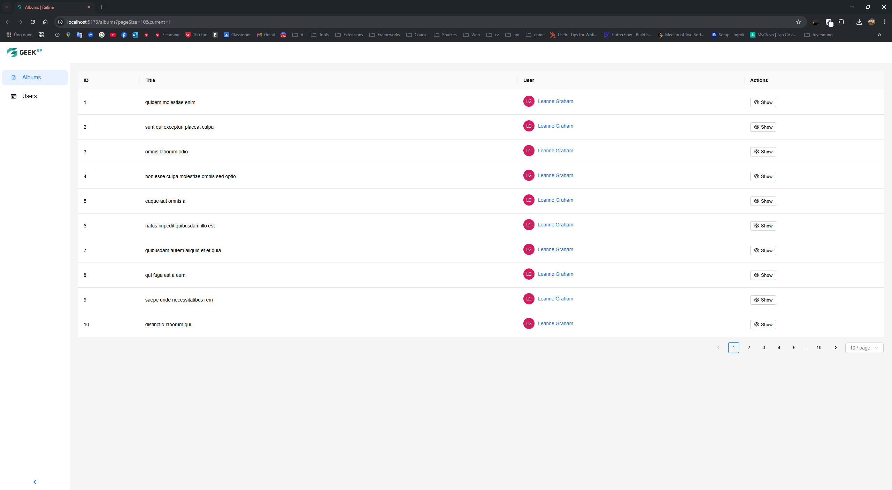
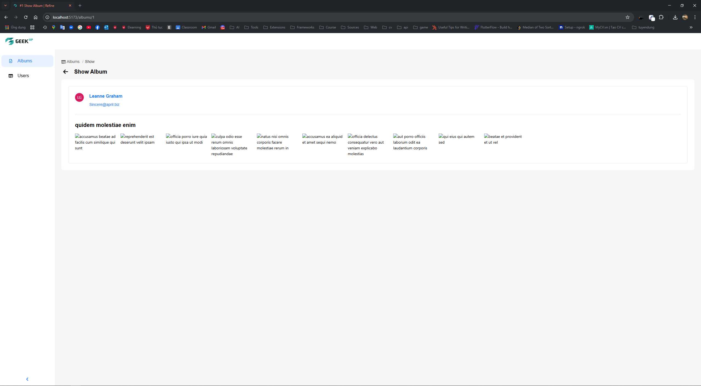
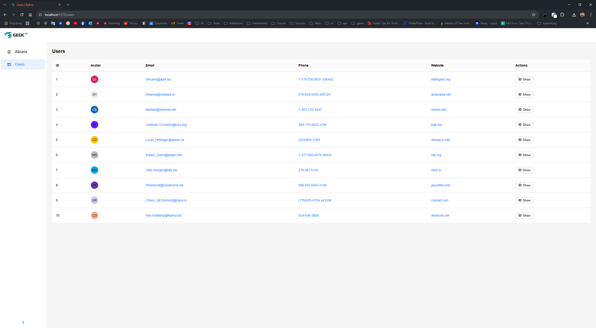
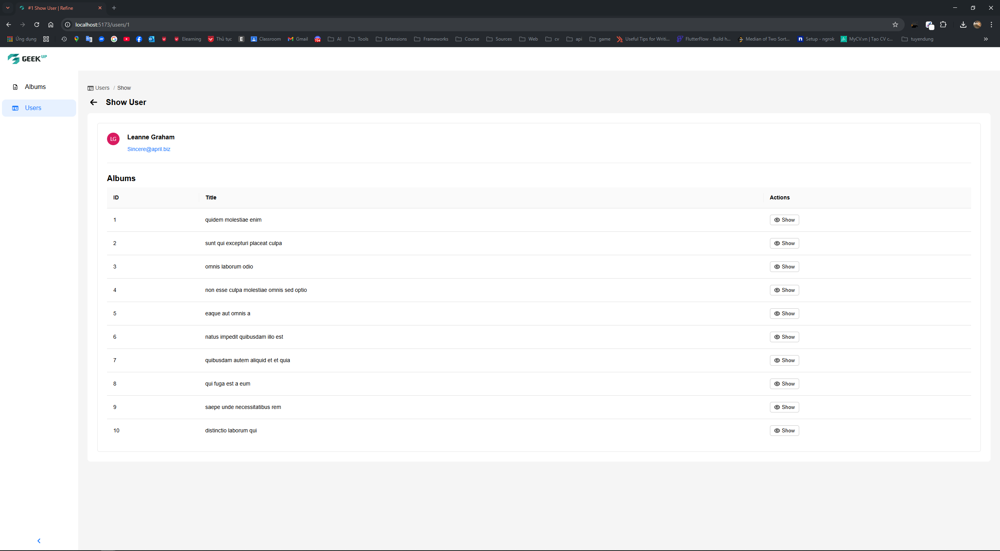

# 📸 React + Vite + TypeScript

---

## 🛠️ Technologies Used

- ⚛️ **React** – A library for building user interfaces.
- ⚡ **Vite** – A super-fast build tool for React projects.
- 🔀 **React Router DOM** – Client-side routing.
- 🎨 **CSS Modules** – Scoped and modular CSS for each component.
- 🌟 **FontAwesome Icons** – A popular icon library.
- 🧠 **Tippy.js for React** – Easy-to-use and customizable tooltips.
- 🖼️ **Atnd Image** – Optimized image rendering.

---

## 📁 Main Folder Structure

```
src/
├─ App.module.css
├─ App.tsx
├─ main.tsx
├─ assets/
│  └─ images/
├─ components/ 
│  ├─ Breadcrumb/
│  ├─ Button/
│  ├─ CustomDropdown/
│  ├─ GlobalStyles/
│  ├─ Header/
│  ├─ MenuBar/
│  ├─ Pagination/
│  ├─ ShimmerContent/
│  └─ ShimmerRow/
├─ pages/
│  ├─ Albums/
│  ├─ AlbumsDetailsPage/
│  ├─ UserDetailsPage/
│  └─ Users/
├─ routes/
├─ services/
└─ types/
```

---

## ⚙️ Setup & Run the Application

### 📥 1. Clone the Project

```bash
git clone https://github.com/Vunghiak3/Albums.git
cd Albums
```

### 📦 2. Install Dependencies

Using **npm**:

```bash
npm install
```

Or **yarn**:

```bash
yarn install
```

### ▶️ 3. Run the Application

Using **npm**:

```bash
npm run dev
```

Or **yarn**:

```bash
yarn dev
```

✨ The application will run at: [http://localhost:5173](http://localhost:5173)

## Run Results
### 1. Albums Page


### 2. Album Detail Page


### 3. Users Page


### 4. User Detail Page

